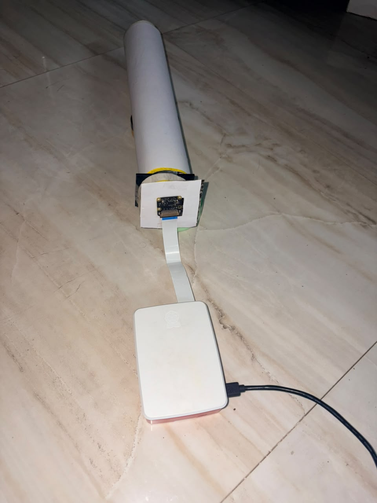
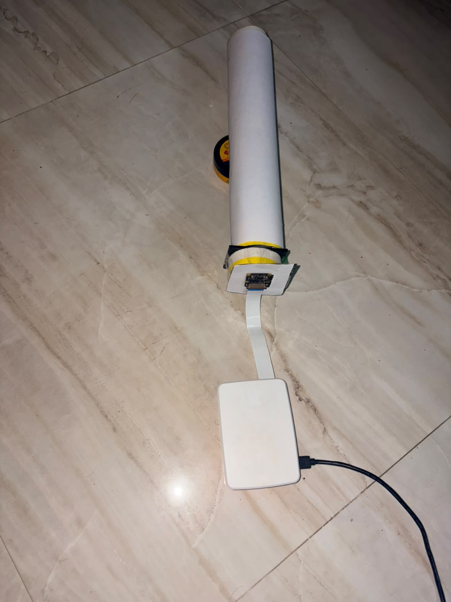
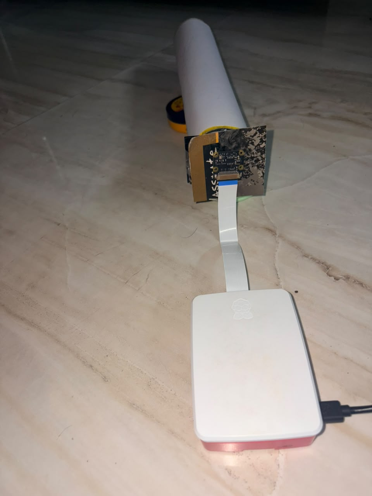
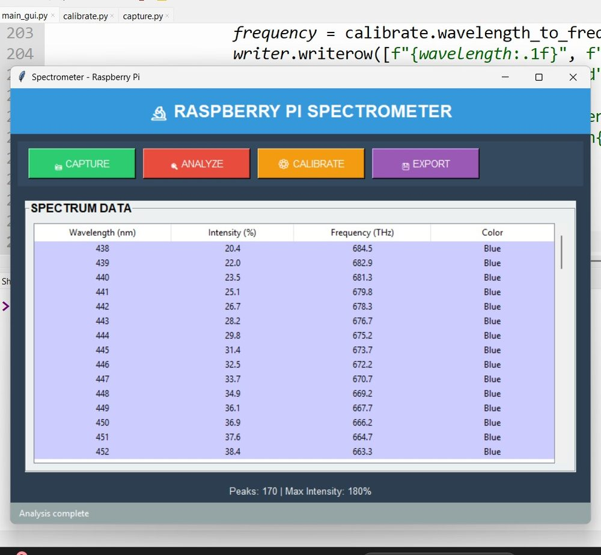
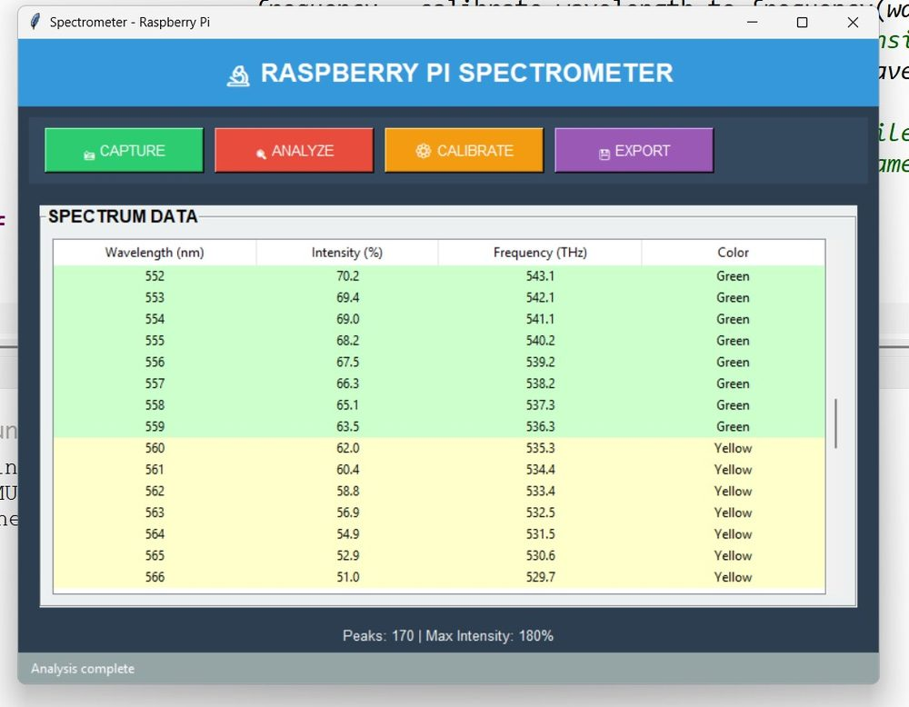
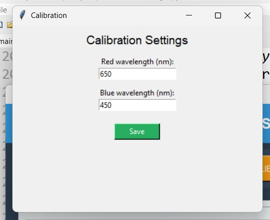

# Raspberry Pi Spectrometer

A low-cost optical spectrometer built with a Raspberry Pi, camera, diffraction grating, and a Python/OpenCV analysis pipeline.

The system captures a dispersed light spectrum, converts camera position into wavelength, calculates frequency, classifies visible colors, and exports the measured spectrum as CSV.

## Features

- Real-time spectrum capture using a Raspberry Pi camera
- Wavelength calibration using reference wavelengths
- Relative intensity analysis
- Frequency calculation in THz
- Visible-light color classification
- CSV spectrum export
- Graphical interface built with Tkinter

## Project Overview

### Hardware

The prototype consists of:

- Raspberry Pi
- Raspberry Pi Camera / compatible camera
- Diffraction grating
- Custom optical enclosure / tube
- Camera ribbon cable
- Python-based analysis application

<p align="center">
  
</p>

The camera is positioned to view the dispersed spectrum through the optical tube. Stable alignment, focus, exposure, and a controlled light path are important for consistent measurements.

<p align="center">
  
</p>

<p align="center">
  
</p>

## Software

The application provides four main functions:

1. **Capture** – acquire an image from the camera.
2. **Analyze** – extract the spectrum and calculate wavelength, intensity, frequency, and color.
3. **Calibrate** – configure the reference wavelengths used by the wavelength mapping.
4. **Export** – save the analyzed spectrum as a CSV file.

### Spectrum Analysis

<p align="center">
  
</p>

The GUI displays:

- Wavelength (nm)
- Relative intensity (%)
- Frequency (THz)
- Approximate visible-light color

<p align="center">
  
</p>

### Calibration

<p align="center">
  
</p>

The default calibration references are:

- Blue: **450 nm**
- Red: **650 nm**

For improved accuracy, the calibration can be extended to use multiple known spectral lines instead of only two endpoints.

## How It Works

```text
Camera
  ↓
Capture spectrum image
  ↓
OpenCV image processing
  ↓
Extract intensity profile
  ↓
Normalize intensity
  ↓
Pixel position → wavelength
  ↓
Wavelength → frequency
  ↓
Color classification
  ↓
GUI / CSV export
```

Frequency is calculated using:

```text
f = c / λ
```

where `c` is the speed of light and `λ` is wavelength.

## Calibration Model

The current implementation uses a simple linear mapping between the calibrated blue and red reference wavelengths:

```text
wavelength = blue_nm + position_ratio × (red_nm - blue_nm)
```

This keeps the implementation simple and easy to understand.

A future version can use multiple reference lines and polynomial calibration to compensate for optical non-linearity and improve wavelength accuracy.

## Project Structure

```text
raspberry-pi-spectrometer/
├── src/
│   ├── main_gui.py
│   ├── capture.py
│   ├── calibrate.py
│   └── analysis.py
├── docs/
│   └── images/
│       ├── gui-spectrum-blue.jpg
│       ├── calibration-window.jpg
│       ├── gui-spectrum-green.jpg
│       ├── hardware-front.jpg
│       ├── hardware-rear.jpg
│       └── hardware-closeup.jpg
├── config.json
├── requirements.txt
├── .gitignore
└── README.md
```

## Installation

On Raspberry Pi OS:

```bash
sudo apt update
sudo apt install python3-tk python3-opencv
sudo apt install python3-picamera2
```

Create a virtual environment if desired:

```bash
python3 -m venv .venv
source .venv/bin/activate
pip install -r requirements.txt
```

Run the application:

```bash
python3 src/main_gui.py
```

## Technologies Used

- **Python**
- **Tkinter**
- **OpenCV**
- **NumPy**
- **Picamera2**
- **Raspberry Pi**
- **Diffraction grating / optical spectroscopy**

## Accuracy

This is a low-cost educational spectrometer rather than a laboratory-grade instrument. Results depend on camera response, optical alignment, focus, exposure, diffraction-grating geometry, and calibration quality.

## Future Improvements

- Multi-point wavelength calibration
- Polynomial calibration
- Automatic peak detection
- Real-time spectrum graphing
- Dark-frame subtraction
- Automatic exposure control
- Saving measurement sessions
- Real-time spectrum visualization

## License

This project is licensed under the MIT License.
